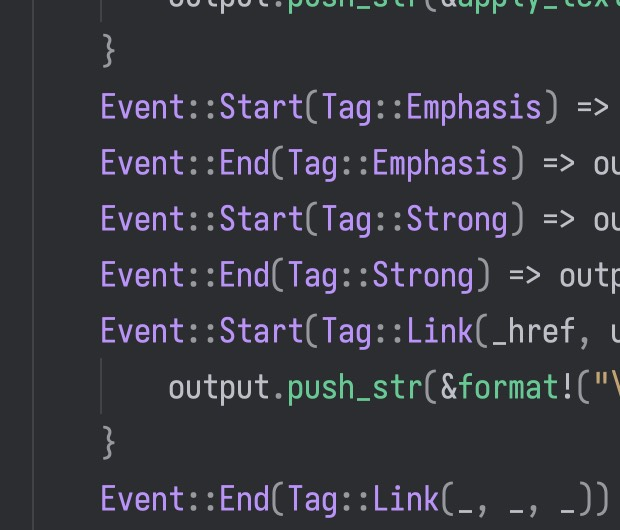

# 标题一 {%}

## 小节标题 C#

这是一个**加粗**和*斜体*的文本。

这里是一个链接：[Google](https://www.google.com)

我们引用了一些文献[`foo`]，还有公式：$E = mc^2$

`Code { Rust }` 是正常的吗，`foo_bar` 呢？
``` cpp
bool foo = true;
#define BLOCK_LIST "Block List, 'Block List'^{}";
```

``` latex raw
\input{}
```

| 名称       | 字段名             | 类型与范围               | 描述                                               |
| ---------- | ------------------ | ------------------------ | -------------------------------------------------- |
| 基础色贴图 | base_color_texture | 可选贴图                 | 一个物体的基本颜色的贴图，用顶点（片源）的 UV 采样 |
| 法线贴图   | normal_texture     | 可选贴图                 | 存储法线信息的贴图，用顶点（片源）的 UV 采样       |
| 颜色       | color              | [f32; 4]                 | 会与基础色贴图相乘                                 |
| 粗糙度     | roughness          | f32 [0.0~1.0]            | 影响材质的粗糙感的参数，参与微表面模型的计算       |
| 金属度     | metallic           | f32 [0.0~1.0]            | 影响材质的金属感的参数，参与微表面模型的计算       |
| 反射度     | reflectance        | f32 [0.0~1.0]            | 影响材质的高光强度的参数，参与微表面模型的计算     |
| Alpha 模式 | alpha_mode         | 枚举：不透明、蒙板、混合 | 决定物体渲染方式的参数                             |


C# 啊啊啊

段落结束。

- 无序列表
- 无序列表是无序号的
- 无序列表是个列表

1. 有序列表
2. 有序列表是有序号的
3. 有序列表是个列表



$$hhhhh
\frac{1}{2}\mu
$$
